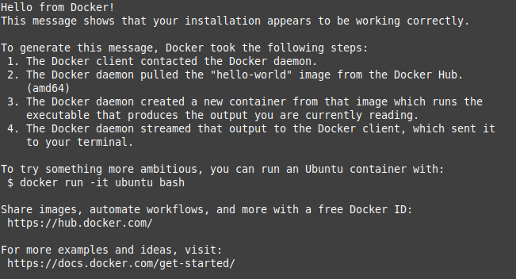
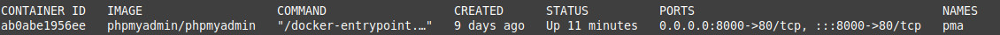
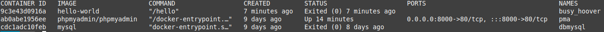
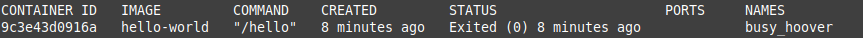
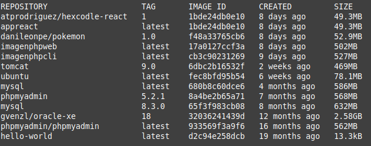

<div align="center">

# **Tarea 1 | Docker**


</div>

<div align="justify">

## Indice
- [Paso 1](#1)
- [Paso 2](#2)

___

### ***Paso 1 - Trabajar con imágenes de Docker*** <a name="1"></a>
***Los contenedores de Docker se construyen con imágenes de Docker. Por defecto, Docker obtiene estas imágenes de Docker Hub, un registro de Docker gestionado por Docker, la empresa responsable del proyecto Docker. Cualquiera puede alojar sus imágenes en Docker Hub, de modo que la mayoría de las aplicaciones y las distribuciones de Linux que necesitará tendrán imágenes alojadas allí.***

***Para verificar si puede acceder a imágenes y descargarlas de Docker Hub, escriba lo siguiente:***

```bash
  docker run hello-world
```

**Salida:**    


### ***Paso 2 - Administrar contenedores de Docker*** <a name="2"></a>
***Después de usar Docker durante un tiempo, tendrá muchos contenedores activos (en ejecución) e inactivos en su computadora. Para ver los activos, utilice lo siguiente:***

- *docker ps*: Lista los **contenedores** activos actualmente
```bash
  docker ps
```


**Salida:**   
   

*docker ps -a*: Lista **todos** los **contenedores**
```bash 
    docker ps -a
```

**Salida:**   


*docker ps -l*: Lista el **último contenedor** 
```bash 
    docker ps -l
```

**Salida:**   


*docker images*: Lista las **imágenes** docker
```bash 
    docker images
```

**Salida:**   


</div>