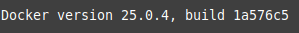
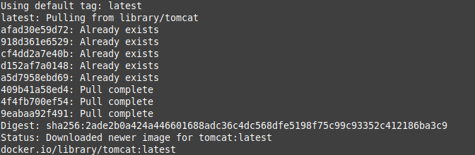
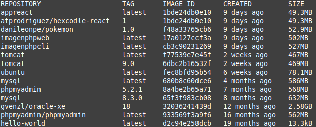
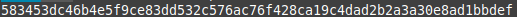
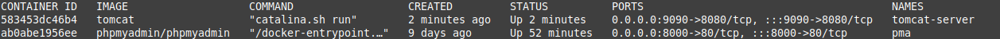
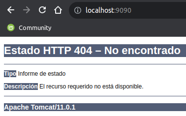
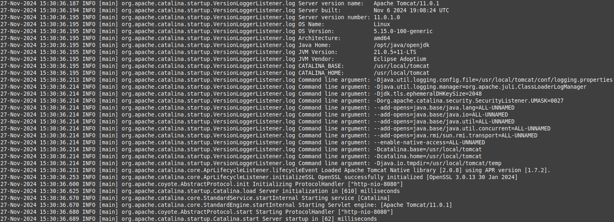
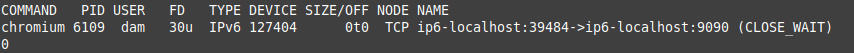
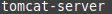
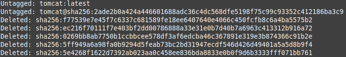

<div align="center">

# **Tarea 2 | Docker**
## **Instalacion de Apache Tomcat**
  

</div>

<div align="justify">

## Indice
- [Paso 1](#1)
- [Paso 2](#2)

___

### Paso 1 - Preparación del entorno <a name="1"></a>
- 1: ***Verifica que Docker está instalado y funcionando***
```bash
docker --version
```

**Salida:**   
  

-2: ***Asegúrate de que ningún servicio en tu máquina está utilizando el puerto 8080 (o el puerto que desees asignar).***

*lsof -i :8080*: Indica si hay un servicio activo en el puerto utilizado  
*echo $?*: Mostrara en pantalla un 0 si hay un servicio activo o un 1 si el puerto está libre

```bash
lsof -i :8080 ; echo $?
```

**Salida:**   
  


### Paso 2 - Descargar la imagen de Tomcat <a name="2"></a>
- 1: ***Descarga la imagen oficial de Apache Tomcat desde Docker Hub:***

```bash
docker pull tomcat
```

**Salida:**   
  

- 2: ***Confirma que la imagen fue descargada correctamente***   

```bash
docker images
```

**Salida**:   
  

### Paso 3 - Ejecutar el contenedor de Tomcat <a name="3"></a>
- 1: ***Inicia un contenedor basado en la imagen de Tomcat, asignando un puerto específico (por ejemplo, 9090 en la máquina anfitriona):***

*-d:* Ejecuta el contenedor en segundo plano.   
*-p 9090:8080:* Mapea el puerto 8080 del contenedor al puerto 9090 de la máquina anfitriona.   
*--name tomcat-server:* Asigna un nombre personalizado al contenedor   
```bash
docker run -d -p 9090:8080 --name tomcat-server tomcat
```

**Salida**:   
  

- 2: ***Verifica que el contenedor está en ejecución:***

```bash
docker ps
```

**Salida**:

  

### Paso 4 - Probar la configuración <a name="4"></a>
- 1: ***Abre un navegador web y accede a la dirección:***  

> [!IMPORTANT]  
> Si utilizas Docker en un servidor remoto, reemplaza localhost con la dirección IP del servidor.

     


- 2: ***Tanto si accedes por el navegador como si no, accede a los logs del servidor para ver si el arranque ha sido correcto:***

```bash
docker logs tomcat-server
```

**Salida**:
  

**Verifica además que no hubieran conflicto de puertos:**
> :memo: **IMPORTANTE**: El comando puede dar salida 1 si no se ha cerrado la pagina de localhost pero dará 0 una vez cerrada la pagina

```bash
lsof -i :9090 ; echo $?
```

**Salida**:
  

### Paso 5 - Detener y eliminar el contenedor <a name="5"></a>
- 1: ***Detén el contenedor***
```bash
docker stop tomcat-server
```

**Salida**:   


- 2: ***Elimina el contenedor***
```bash
docker rm tomcat-server
```

**Salida**:   


- 3: ***Si deseas eliminar la imagen de Tomcat de tu sistema***
```bash
docker rmi tomcat
```

**Salida**:


</div