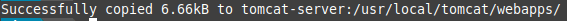
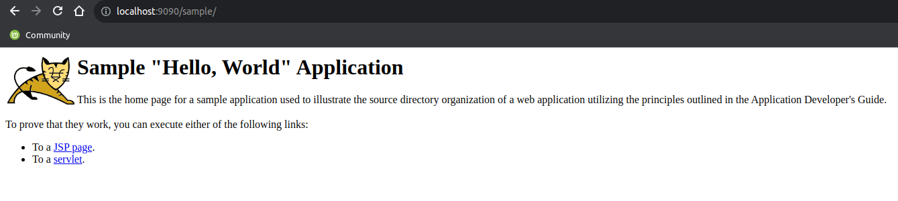
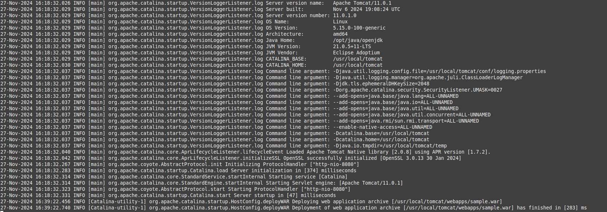

<div align="center">

# **Tarea 3 | Docker**
## **Desplegar una aplicación en Apache Tomcat**


</div>

<div align="justify">

## Indice
- [Paso 1](#1)
- [Paso 2](#2)

___

## **Objetivo - Desplegar una aplicación en Apache Tomcat.**

> :memo: **IMPORTANTE**: Hay que tener el contenedor de tomcat corriendo

## **Prueba con una aplicación de ejemplo**

### Descargar un archivo .war de ejemplo
Puedes descargar una aplicación de ejemplo desde el sitio oficial de Apache Tomcat. Por ejemplo, la Sample Web Application de Tomcat. [Descargar](#https://tomcat.apache.org/tomcat-11.0-doc/appdev/sample/)

### Copiar el archivo .war en el contenedor
Una vez descargado el archivo .war (por ejemplo, sample.war), cópialo al directorio webapps de tu contenedor Tomcat. Si estás ejecutando Tomcat en Docker, puedes hacerlo con un comando como este:

```bash
docker cp /.../sample.war <nombre_contenedor>:/usr/local/tomcat/webapps/
```

**Salida**:   


### Acceder a la aplicación
Una vez copiado el archivo .war y desplegado en Tomcat, puedes acceder a la aplicación de ejemplo a través de la URL: ```http://localhost:9090/sample```



### Verificar logs en caso de problemas
Si la aplicación de ejemplo tampoco funciona, revisa los logs de Tomcat para detectar posibles errores:

```bash
docker logs -f <nombre_contenedor>
```

**Salida**:



### Utiliza docker inspect
Puedas o no acceder, intenta usar la IP del contenedor Docker (que puedes obtener con docker inspect).

```bash
docker inspect tomcat-server
```

**Salida**:
```code
[
    {
        "Id": "8766dfc80874b42cbb10e55b10bdff27941366965a0296d9244013de71354dd9",
        "Created": "2024-11-27T16:18:31.34480241Z",
        "Path": "catalina.sh",
        "Args": [
            "run"
        ],
        "State": {
            "Status": "running",
            "Running": true,
            "Paused": false,
            "Restarting": false,
            "OOMKilled": false,
            "Dead": false,
            "Pid": 46939,
            "ExitCode": 0,
            "Error": "",
            "StartedAt": "2024-11-27T16:18:31.761557015Z",
            "FinishedAt": "0001-01-01T00:00:00Z"
        },
        "Image": "sha256:f77539e7e45f7c6337c681589fe18ee6407640e4066c450fcfb8c6a4ba5575b2",
        "ResolvConfPath": "/var/lib/docker/containers/8766dfc80874b42cbb10e55b10bdff27941366965a0296d9244013de71354dd9/resolv.conf",
        "HostnamePath": "/var/lib/docker/containers/8766dfc80874b42cbb10e55b10bdff27941366965a0296d9244013de71354dd9/hostname",
        "HostsPath": "/var/lib/docker/containers/8766dfc80874b42cbb10e55b10bdff27941366965a0296d9244013de71354dd9/hosts",
        "LogPath": "/var/lib/docker/containers/8766dfc80874b42cbb10e55b10bdff27941366965a0296d9244013de71354dd9/8766dfc80874b42cbb10e55b10bdff27941366965a0296d9244013de71354dd9-json.log",
        "Name": "/tomcat-server",
        "RestartCount": 0,
        "Driver": "overlay2",
        "Platform": "linux",
        "MountLabel": "",
        "ProcessLabel": "",
        "AppArmorProfile": "docker-default",
        "ExecIDs": null,
        "HostConfig": {
            "Binds": null,
            "ContainerIDFile": "",
            "LogConfig": {
                "Type": "json-file",
                "Config": {}
            },
            "NetworkMode": "default",
            "PortBindings": {
                "8080/tcp": [
                    {
                        "HostIp": "",
                        "HostPort": "9090"
                    }
                ]
            },
            "RestartPolicy": {
                "Name": "no",
                "MaximumRetryCount": 0
            },
            "AutoRemove": false,
            "VolumeDriver": "",
            "VolumesFrom": null,
            "ConsoleSize": [
                57,
                238
            ],
            "CapAdd": null,
            "CapDrop": null,
            "CgroupnsMode": "private",
            "Dns": [],
            "DnsOptions": [],
            "DnsSearch": [],
            "ExtraHosts": null,
            "GroupAdd": null,
            "IpcMode": "private",
            "Cgroup": "",
            "Links": null,
            "OomScoreAdj": 0,
            "PidMode": "",
            "Privileged": false,
            "PublishAllPorts": false,
            "ReadonlyRootfs": false,
            "SecurityOpt": null,
            "UTSMode": "",
            "UsernsMode": "",
            "ShmSize": 67108864,
            "Runtime": "runc",
            "Isolation": "",
            "CpuShares": 0,
            "Memory": 0,
            "NanoCpus": 0,
            "CgroupParent": "",
            "BlkioWeight": 0,
            "BlkioWeightDevice": [],
            "BlkioDeviceReadBps": [],
            "BlkioDeviceWriteBps": [],
            "BlkioDeviceReadIOps": [],
            "BlkioDeviceWriteIOps": [],
            "CpuPeriod": 0,
            "CpuQuota": 0,
            "CpuRealtimePeriod": 0,
            "CpuRealtimeRuntime": 0,
            "CpusetCpus": "",
            "CpusetMems": "",
            "Devices": [],
            "DeviceCgroupRules": null,
            "DeviceRequests": null,
            "MemoryReservation": 0,
            "MemorySwap": 0,
            "MemorySwappiness": null,
            "OomKillDisable": null,
            "PidsLimit": null,
            "Ulimits": [],
            "CpuCount": 0,
            "CpuPercent": 0,
            "IOMaximumIOps": 0,
            "IOMaximumBandwidth": 0,
            "MaskedPaths": [
                "/proc/asound",
                "/proc/acpi",
                "/proc/kcore",
                "/proc/keys",
                "/proc/latency_stats",
                "/proc/timer_list",
                "/proc/timer_stats",
                "/proc/sched_debug",
                "/proc/scsi",
                "/sys/firmware",
                "/sys/devices/virtual/powercap"
            ],
            "ReadonlyPaths": [
                "/proc/bus",
                "/proc/fs",
                "/proc/irq",
                "/proc/sys",
                "/proc/sysrq-trigger"
            ]
        },
        "GraphDriver": {
            "Data": {
                "LowerDir": "/var/lib/docker/overlay2/a10a838bd4a6072e4cc1a6ee1a6931dce284ae89a9cd19e583f5402a2c5d70aa-init/diff:/var/lib/docker/overlay2/908b70633f81b91231bbe85bb2698f2ab5382a3c0ace4b9b9a1fffd3c00cd686/diff:/var/lib/docker/overlay2/b76d38fa795e1a779e52fd69810bf06ada9f4b0f507ab7964b47fb4edfaf781b/diff:/var/lib/docker/overlay2/dc00288064e76ec7da54eac549dd7f96cf9a1ccb5eb034149d23ea7bdbd7a16d/diff:/var/lib/docker/overlay2/113cfa6d5a7bfb6535d9d40d3381c2a6377fb2f897d1f18be977e9ad6e4bc536/diff:/var/lib/docker/overlay2/d6931186ef11c289412aeb005ad008f584798da835d3fd240de5d0de4e59f66c/diff:/var/lib/docker/overlay2/778b4ba7cea446713de571e7c6fae6ca70b1cd44d5e586ad992677d3b04c9896/diff:/var/lib/docker/overlay2/3dd1bd126eb19034aaf8aa29d7cd360a1d14ac17d7729ff66a04e822d25d4968/diff:/var/lib/docker/overlay2/c25ce9dc6525370645dd5f224276e9cacdf58da9a3659e30e26a37c5d10e58ea/diff:/var/lib/docker/overlay2/4c03bad9f0b3793b1852bc01aff9897646c5b48f56daa5d8469d72325e5bc948/diff",
                "MergedDir": "/var/lib/docker/overlay2/a10a838bd4a6072e4cc1a6ee1a6931dce284ae89a9cd19e583f5402a2c5d70aa/merged",
                "UpperDir": "/var/lib/docker/overlay2/a10a838bd4a6072e4cc1a6ee1a6931dce284ae89a9cd19e583f5402a2c5d70aa/diff",
                "WorkDir": "/var/lib/docker/overlay2/a10a838bd4a6072e4cc1a6ee1a6931dce284ae89a9cd19e583f5402a2c5d70aa/work"
            },
            "Name": "overlay2"
        },
        "Mounts": [],
        "Config": {
            "Hostname": "8766dfc80874",
            "Domainname": "",
            "User": "",
            "AttachStdin": false,
            "AttachStdout": false,
            "AttachStderr": false,
            "ExposedPorts": {
                "8080/tcp": {}
            },
            "Tty": false,
            "OpenStdin": false,
            "StdinOnce": false,
            "Env": [
                "PATH=/usr/local/tomcat/bin:/opt/java/openjdk/bin:/usr/local/sbin:/usr/local/bin:/usr/sbin:/usr/bin:/sbin:/bin",
                "JAVA_HOME=/opt/java/openjdk",
                "LANG=en_US.UTF-8",
                "LANGUAGE=en_US:en",
                "LC_ALL=en_US.UTF-8",
                "JAVA_VERSION=jdk-21.0.5+11",
                "CATALINA_HOME=/usr/local/tomcat",
                "TOMCAT_NATIVE_LIBDIR=/usr/local/tomcat/native-jni-lib",
                "LD_LIBRARY_PATH=/usr/local/tomcat/native-jni-lib",
                "GPG_KEYS=48F8E69F6390C9F25CFEDCD268248959359E722B A9C5DF4D22E99998D9875A5110C01C5A2F6059E7",
                "TOMCAT_MAJOR=11",
                "TOMCAT_VERSION=11.0.1",
                "TOMCAT_SHA512=dce8800532c9dcb079d456e9ea561ac9b7c854a8c50dfcd78339d077f9db127d86dba339db3fcea16c75039c9201c3446ecd4807efe0d42fcf005d2061cbc090"
            ],
            "Cmd": [
                "catalina.sh",
                "run"
            ],
            "Image": "tomcat",
            "Volumes": null,
            "WorkingDir": "/usr/local/tomcat",
            "Entrypoint": null,
            "OnBuild": null,
            "Labels": {
                "org.opencontainers.image.ref.name": "ubuntu",
                "org.opencontainers.image.version": "24.04"
            }
        },
        "NetworkSettings": {
            "Bridge": "",
            "SandboxID": "57432defa8fb4c99d88375f17fdf45220c78621b203526729c1634073b979733",
            "SandboxKey": "/var/run/docker/netns/57432defa8fb",
            "Ports": {
                "8080/tcp": [
                    {
                        "HostIp": "0.0.0.0",
                        "HostPort": "9090"
                    },
                    {
                        "HostIp": "::",
                        "HostPort": "9090"
                    }
                ]
            },
            "HairpinMode": false,
            "LinkLocalIPv6Address": "",
            "LinkLocalIPv6PrefixLen": 0,
            "SecondaryIPAddresses": null,
            "SecondaryIPv6Addresses": null,
            "EndpointID": "19f87fc5248e725b27972ff50c002456f3904e017cbd1d2c7b73afe424066077",
            "Gateway": "172.17.0.1",
            "GlobalIPv6Address": "",
            "GlobalIPv6PrefixLen": 0,
            "IPAddress": "172.17.0.2",
            "IPPrefixLen": 16,
            "IPv6Gateway": "",
            "MacAddress": "02:42:ac:11:00:02",
            "Networks": {
                "bridge": {
                    "IPAMConfig": null,
                    "Links": null,
                    "Aliases": null,
                    "MacAddress": "02:42:ac:11:00:02",
                    "NetworkID": "f3361d86beedb75c07aba7eef082496f1ba3941614ac013b539d01861e3ad898",
                    "EndpointID": "19f87fc5248e725b27972ff50c002456f3904e017cbd1d2c7b73afe424066077",
                    "Gateway": "172.17.0.1",
                    "IPAddress": "172.17.0.2",
                    "IPPrefixLen": 16,
                    "IPv6Gateway": "",
                    "GlobalIPv6Address": "",
                    "GlobalIPv6PrefixLen": 0,
                    "DriverOpts": null,
                    "DNSNames": null
                }
            }
        }
    }
]

```

</div>