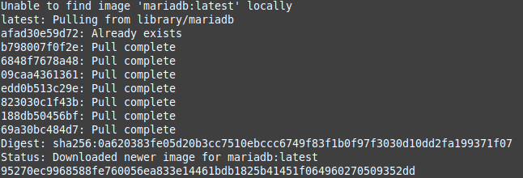
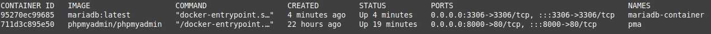
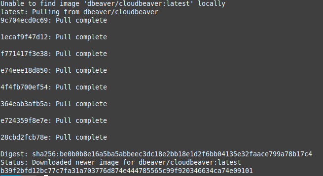
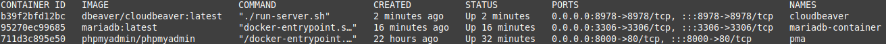
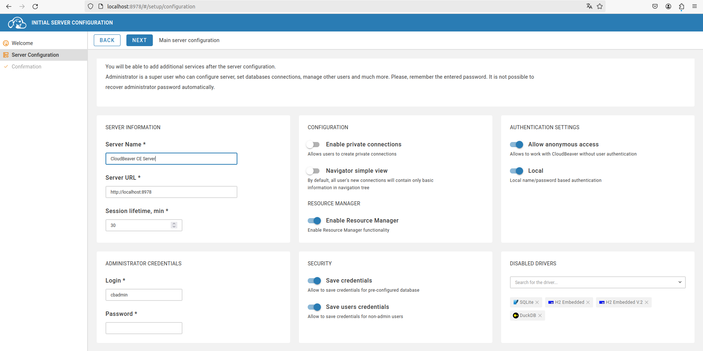
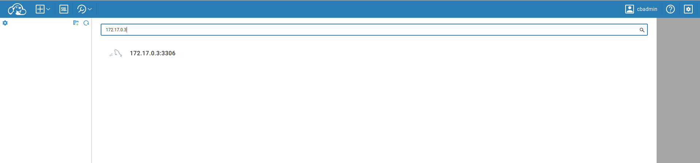
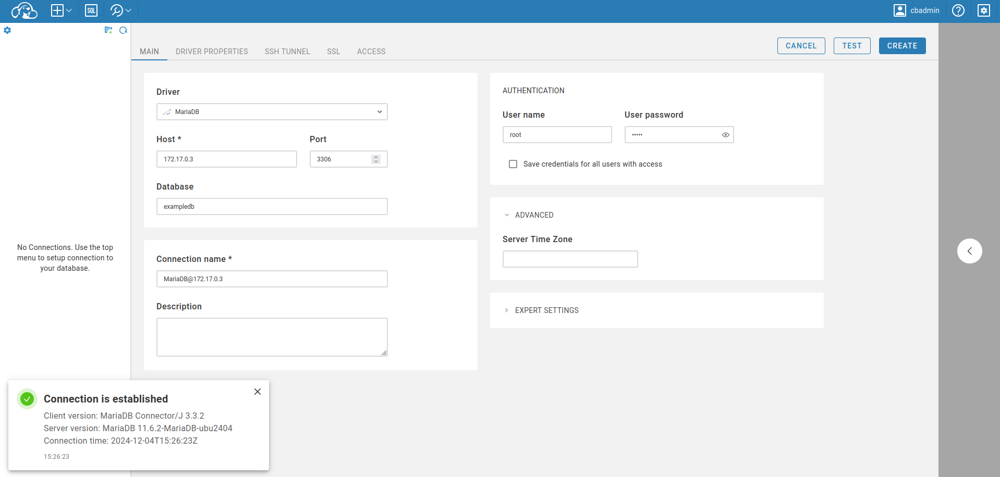

<div align="center">

# **Tarea 4 | Docker**
## **Instalacion de MariaDB**
  

</div>

<div align="justify">

## Indice
- [Paso 1](#1)
- [Paso 2](#2)
- [Paso 3](#3)
- [Paso 4](#4)
- [Paso 5](#5)
- [Paso 6](#6)

___

## **Objetivo - Instalacion y Configuracion de MariaDB.**

### Paso 1 - Descargar e iniciar un contenedor de MariaDB <a name="1"></a>
- **1**: Ejecuta el siguiente comando para descargar la imagen oficial de MariaDB y crear un contenedor:

```bash
docker run --name mariadb-container -e MYSQL_ROOT_PASSWORD=admin -e MYSQL_DATABASE=exampledb -p 3306:3306 -d mariadb:latest
```

**Salida**:   


- **2**: Verificar que el contenedor esté corriendo

    Ejecuta el siguiente comando para listar los contenedores en ejecución:
    
    ```bash
    docker ps
    ```

    **Salida**:   
    

- **3**: Verificar logs en caso de problemas   

    Si la aplicación de ejemplo tampoco funciona, revisa los logs de Tomcat para detectar posibles errores:

    ```bash
    docker logs -f <nombre_contenedor>
    ```

    **Salida**:
    ```code
    2024-11-28 14:50:04+00:00 [Note] [Entrypoint]: Entrypoint script for MariaDB Server 1:11.6.2+maria~ubu2404 started.
    2024-11-28 14:50:04+00:00 [Warn] [Entrypoint]: /sys/fs/cgroup///memory.pressure not writable, functionality unavailable to MariaDB
    2024-11-28 14:50:04+00:00 [Note] [Entrypoint]: Switching to dedicated user 'mysql'
    2024-11-28 14:50:04+00:00 [Note] [Entrypoint]: Entrypoint script for MariaDB Server 1:11.6.2+maria~ubu2404 started.
    2024-11-28 14:50:05+00:00 [Note] [Entrypoint]: Initializing database files
    2024-11-28 14:50:11+00:00 [Note] [Entrypoint]: Database files initialized
    2024-11-28 14:50:11+00:00 [Note] [Entrypoint]: Starting temporary server
    2024-11-28 14:50:11+00:00 [Note] [Entrypoint]: Waiting for server startup
    2024-11-28 14:50:11 0 [Note] Starting MariaDB 11.6.2-MariaDB-ubu2404 source revision d8dad8c3b54cd09fefce7bc3b9749f427eed9709 server_uid KjyTHYnzkWxRQBEIh5uvt04ggeY= as process 92
    2024-11-28 14:50:12 0 [Note] InnoDB: Compressed tables use zlib 1.3
    2024-11-28 14:50:12 0 [Note] InnoDB: Number of transaction pools: 1
    2024-11-28 14:50:12 0 [Note] InnoDB: Using crc32 + pclmulqdq instructions
    2024-11-28 14:50:12 0 [Note] mariadbd: O_TMPFILE is not supported on /tmp (disabling future attempts)
    2024-11-28 14:50:12 0 [Note] InnoDB: Initializing buffer pool, total size = 128.000MiB, chunk size = 2.000MiB
    2024-11-28 14:50:12 0 [Note] InnoDB: Completed initialization of buffer pool
    2024-11-28 14:50:12 0 [Note] InnoDB: File system buffers for log disabled (block size=512 bytes)
    2024-11-28 14:50:12 0 [Note] InnoDB: End of log at LSN=47629
    2024-11-28 14:50:12 0 [Note] InnoDB: Opened 3 undo tablespaces
    2024-11-28 14:50:12 0 [Note] InnoDB: 128 rollback segments in 3 undo tablespaces are active.
    2024-11-28 14:50:12 0 [Note] InnoDB: Setting file './ibtmp1' size to 12.000MiB. Physically writing the file full; Please wait ...
    2024-11-28 14:50:12 0 [Note] InnoDB: File './ibtmp1' size is now 12.000MiB.
    2024-11-28 14:50:12 0 [Note] InnoDB: log sequence number 47629; transaction id 14
    2024-11-28 14:50:12 0 [Note] Plugin 'FEEDBACK' is disabled.
    2024-11-28 14:50:12 0 [Note] Plugin 'wsrep-provider' is disabled.
    2024-11-28 14:50:12 0 [Note] mariadbd: Event Scheduler: Loaded 0 events
    2024-11-28 14:50:13 0 [Note] mariadbd: ready for connections.
    Version: '11.6.2-MariaDB-ubu2404'  socket: '/run/mysqld/mysqld.sock'  port: 0  mariadb.org binary distribution
    2024-11-28 14:50:13+00:00 [Note] [Entrypoint]: Temporary server started.
    2024-11-28 14:50:14+00:00 [Note] [Entrypoint]: Creating database exampledb
    2024-11-28 14:50:14+00:00 [Note] [Entrypoint]: Securing system users (equivalent to running mysql_secure_installation)

    2024-11-28 14:50:14+00:00 [Note] [Entrypoint]: Stopping temporary server
    2024-11-28 14:50:14 0 [Note] mariadbd (initiated by: unknown): Normal shutdown
    2024-11-28 14:50:14 0 [Note] InnoDB: FTS optimize thread exiting.
    2024-11-28 14:50:14 0 [Note] InnoDB: Starting shutdown...
    2024-11-28 14:50:14 0 [Note] InnoDB: Dumping buffer pool(s) to /var/lib/mysql/ib_buffer_pool
    2024-11-28 14:50:14 0 [Note] InnoDB: Buffer pool(s) dump completed at 241128 14:50:14
    2024-11-28 14:50:14 0 [Note] InnoDB: Removed temporary tablespace data file: "./ibtmp1"
    2024-11-28 14:50:14 0 [Note] InnoDB: Shutdown completed; log sequence number 47629; transaction id 15
    2024-11-28 14:50:14 0 [Note] mariadbd: Shutdown complete

    2024-11-28 14:50:14+00:00 [Note] [Entrypoint]: Temporary server stopped

    2024-11-28 14:50:14+00:00 [Note] [Entrypoint]: MariaDB init process done. Ready for start up.

    2024-11-28 14:50:14 0 [Note] Starting MariaDB 11.6.2-MariaDB-ubu2404 source revision d8dad8c3b54cd09fefce7bc3b9749f427eed9709 server_uid KjyTHYnzkWxRQBEIh5uvt04ggeY= as process 1
    2024-11-28 14:50:14 0 [Note] InnoDB: Compressed tables use zlib 1.3
    2024-11-28 14:50:14 0 [Note] InnoDB: Number of transaction pools: 1
    2024-11-28 14:50:14 0 [Note] InnoDB: Using crc32 + pclmulqdq instructions
    2024-11-28 14:50:14 0 [Note] mariadbd: O_TMPFILE is not supported on /tmp (disabling future attempts)
    2024-11-28 14:50:14 0 [Note] InnoDB: Initializing buffer pool, total size = 128.000MiB, chunk size = 2.000MiB
    2024-11-28 14:50:14 0 [Note] InnoDB: Completed initialization of buffer pool
    2024-11-28 14:50:14 0 [Note] InnoDB: File system buffers for log disabled (block size=512 bytes)
    2024-11-28 14:50:14 0 [Note] InnoDB: End of log at LSN=47629
    2024-11-28 14:50:14 0 [Note] InnoDB: Opened 3 undo tablespaces
    2024-11-28 14:50:14 0 [Note] InnoDB: 128 rollback segments in 3 undo tablespaces are active.
    2024-11-28 14:50:14 0 [Note] InnoDB: Setting file './ibtmp1' size to 12.000MiB. Physically writing the file full; Please wait ...
    2024-11-28 14:50:14 0 [Note] InnoDB: File './ibtmp1' size is now 12.000MiB.
    2024-11-28 14:50:14 0 [Note] InnoDB: log sequence number 47629; transaction id 14
    2024-11-28 14:50:14 0 [Note] Plugin 'FEEDBACK' is disabled.
    2024-11-28 14:50:14 0 [Note] Plugin 'wsrep-provider' is disabled.
    2024-11-28 14:50:14 0 [Note] InnoDB: Loading buffer pool(s) from /var/lib/mysql/ib_buffer_pool
    2024-11-28 14:50:14 0 [Note] InnoDB: Buffer pool(s) load completed at 241128 14:50:14
    2024-11-28 14:50:15 0 [Note] Server socket created on IP: '0.0.0.0'.
    2024-11-28 14:50:15 0 [Note] Server socket created on IP: '::'.
    2024-11-28 14:50:15 0 [Note] mariadbd: Event Scheduler: Loaded 0 events
    2024-11-28 14:50:15 0 [Note] mariadbd: ready for connections.
    Version: '11.6.2-MariaDB-ubu2404'  socket: '/run/mysqld/mysqld.sock'  port: 3306  mariadb.org binary distribution
    ```
- **4**: Utiliza docker inspect.   
    
    Puedas o no acceder, intenta usar la IP del contenedor Docker (que puedes obtener con docker inspect).

    ```bash
    docker inspect <nombre_contenedor>
    ```

    **Salida**:   
    ```bash
    [
    {
        "Id": "95270ec9968588fe760056ea833e14461bdb1825b41451f064960270509352dd",
        "Created": "2024-11-28T14:50:03.300779401Z",
        "Path": "docker-entrypoint.sh",
        "Args": [
            "mariadbd"
        ],
        "State": {
            "Status": "running",
            "Running": true,
            "Paused": false,
            "Restarting": false,
            "OOMKilled": false,
            "Dead": false,
            "Pid": 14220,
            "ExitCode": 0,
            "Error": "",
            "StartedAt": "2024-11-28T14:50:04.377343014Z",
            "FinishedAt": "0001-01-01T00:00:00Z"
        },
        "Image": "sha256:052f9e69b7b03f7464f4579766e30a795ebf8e93c65cf47698e2869bf882bbe3",
        "ResolvConfPath": "/var/lib/docker/containers/95270ec9968588fe760056ea833e14461bdb1825b41451f064960270509352dd/resolv.conf",
        "HostnamePath": "/var/lib/docker/containers/95270ec9968588fe760056ea833e14461bdb1825b41451f064960270509352dd/hostname",
        "HostsPath": "/var/lib/docker/containers/95270ec9968588fe760056ea833e14461bdb1825b41451f064960270509352dd/hosts",
        "LogPath": "/var/lib/docker/containers/95270ec9968588fe760056ea833e14461bdb1825b41451f064960270509352dd/95270ec9968588fe760056ea833e14461bdb1825b41451f064960270509352dd-json.log",
        "Name": "/mariadb-container",
        "RestartCount": 0,
        "Driver": "overlay2",
        "Platform": "linux",
        "MountLabel": "",
        "ProcessLabel": "",
        "AppArmorProfile": "docker-default",
        "ExecIDs": null,
        "HostConfig": {
            "Binds": null,
            "ContainerIDFile": "",
            "LogConfig": {
                "Type": "json-file",
                "Config": {}
            },
            "NetworkMode": "default",
            "PortBindings": {
                "3306/tcp": [
                    {
                        "HostIp": "",
                        "HostPort": "3306"
                    }
                ]
            },
            "RestartPolicy": {
                "Name": "no",
                "MaximumRetryCount": 0
            },
            "AutoRemove": false,
            "VolumeDriver": "",
            "VolumesFrom": null,
            "ConsoleSize": [
                24,
                80
            ],
            "CapAdd": null,
            "CapDrop": null,
            "CgroupnsMode": "private",
            "Dns": [],
            "DnsOptions": [],
            "DnsSearch": [],
            "ExtraHosts": null,
            "GroupAdd": null,
            "IpcMode": "private",
            "Cgroup": "",
            "Links": null,
            "OomScoreAdj": 0,
            "PidMode": "",
            "Privileged": false,
            "PublishAllPorts": false,
            "ReadonlyRootfs": false,
            "SecurityOpt": null,
            "UTSMode": "",
            "UsernsMode": "",
            "ShmSize": 67108864,
            "Runtime": "runc",
            "Isolation": "",
            "CpuShares": 0,
            "Memory": 0,
            "NanoCpus": 0,
            "CgroupParent": "",
            "BlkioWeight": 0,
            "BlkioWeightDevice": [],
            "BlkioDeviceReadBps": [],
            "BlkioDeviceWriteBps": [],
            "BlkioDeviceReadIOps": [],
            "BlkioDeviceWriteIOps": [],
            "CpuPeriod": 0,
            "CpuQuota": 0,
            "CpuRealtimePeriod": 0,
            "CpuRealtimeRuntime": 0,
            "CpusetCpus": "",
            "CpusetMems": "",
            "Devices": [],
            "DeviceCgroupRules": null,
            "DeviceRequests": null,
            "MemoryReservation": 0,
            "MemorySwap": 0,
            "MemorySwappiness": null,
            "OomKillDisable": null,
            "PidsLimit": null,
            "Ulimits": [],
            "CpuCount": 0,
            "CpuPercent": 0,
            "IOMaximumIOps": 0,
            "IOMaximumBandwidth": 0,
            "MaskedPaths": [
                "/proc/asound",
                "/proc/acpi",
                "/proc/kcore",
                "/proc/keys",
                "/proc/latency_stats",
                "/proc/timer_list",
                "/proc/timer_stats",
                "/proc/sched_debug",
                "/proc/scsi",
                "/sys/firmware",
                "/sys/devices/virtual/powercap"
            ],
            "ReadonlyPaths": [
                "/proc/bus",
                "/proc/fs",
                "/proc/irq",
                "/proc/sys",
                "/proc/sysrq-trigger"
            ]
        },
        "GraphDriver": {
            "Data": {
                "LowerDir": "/var/lib/docker/overlay2/c9806e98c77b7584a94c57e1ebd0cf4fe5c6970562b026dbf11a15b2f8e78f47-init/diff:/var/lib/docker/overlay2/613b8810d8b4cd81607c9d38b77176a2b31a343ef2945a2495d8f21c59f4a0c1/diff:/var/lib/docker/overlay2/0de49aa13df2c95ac466e08c8f70e9c31fc373183dc93c93b518c64246867f31/diff:/var/lib/docker/overlay2/2e6bd8d9fb460b5b1947cefc6514f138bb9f0fb6807b4b4460aee2a429fff9b1/diff:/var/lib/docker/overlay2/3a280bcd1e74f31b647ee532d50539c319a5d9733cc2c57cdd4ab8ac6593af3c/diff:/var/lib/docker/overlay2/0641906a31243111844b89b21ddacda3e0cef0df1b83d019dc5fb3fa3bda184e/diff:/var/lib/docker/overlay2/e7d809323d87b32c368a270b34d12c9f00060ed903265204611d0d3ad6d36a8e/diff:/var/lib/docker/overlay2/b9bcaae71dcd85f266f1e4c624df060ed7d6cd90c4f72f202a7e63ea9a175623/diff:/var/lib/docker/overlay2/4c03bad9f0b3793b1852bc01aff9897646c5b48f56daa5d8469d72325e5bc948/diff",
                "MergedDir": "/var/lib/docker/overlay2/c9806e98c77b7584a94c57e1ebd0cf4fe5c6970562b026dbf11a15b2f8e78f47/merged",
                "UpperDir": "/var/lib/docker/overlay2/c9806e98c77b7584a94c57e1ebd0cf4fe5c6970562b026dbf11a15b2f8e78f47/diff",
                "WorkDir": "/var/lib/docker/overlay2/c9806e98c77b7584a94c57e1ebd0cf4fe5c6970562b026dbf11a15b2f8e78f47/work"
            },
            "Name": "overlay2"
        },
        "Mounts": [
            {
                "Type": "volume",
                "Name": "f7d3f732be77924c06f1b994b2b40a490c55bab7e38a2f6e1dddb2aec3b40b66",
                "Source": "/var/lib/docker/volumes/f7d3f732be77924c06f1b994b2b40a490c55bab7e38a2f6e1dddb2aec3b40b66/_data",
                "Destination": "/var/lib/mysql",
                "Driver": "local",
                "Mode": "",
                "RW": true,
                "Propagation": ""
            }
        ],
        "Config": {
            "Hostname": "95270ec99685",
            "Domainname": "",
            "User": "",
            "AttachStdin": false,
            "AttachStdout": false,
            "AttachStderr": false,
            "ExposedPorts": {
                "3306/tcp": {}
            },
            "Tty": false,
            "OpenStdin": false,
            "StdinOnce": false,
            "Env": [
                "MYSQL_ROOT_PASSWORD=admin",
                "MYSQL_DATABASE=exampledb",
                "PATH=/usr/local/sbin:/usr/local/bin:/usr/sbin:/usr/bin:/sbin:/bin",
                "GOSU_VERSION=1.17",
                "LANG=C.UTF-8",
                "MARIADB_VERSION=1:11.6.2+maria~ubu2404"
            ],
            "Cmd": [
                "mariadbd"

    ```

### Paso 2 - Descargar un cliente de base de datos para MariaDB (Adminer) <a name="2"></a>
En primer lugar debemos de encontrar un cliente de bbdd que este en docker. Uno de ellos, con una buena interfaz gráfica es CloudBeaver.

- **1**: Descargar y ejecutar CloudBeaver en Docker.   

    Ejecuta el siguiente comando para iniciar un contenedor de CloudBeaver:

    ```bash
    docker run -d --name cloudbeaver -p 8978:8978 dbeaver/cloudbeaver:latest
    ```

    **Salida**:   
    

    ```bash
    docker ps
    ```

    **Salida**: 
    
    
### Paso 3 - Acceder a la interfaz de CloudBeaver <a name="3"></a>

- Abre un navegador web.
- Navega a la dirección http://localhost:8978.
- Sigue las instrucciones de configuración inicial.




### Paso 4 - Encontrar la BBDD <a name="4"></a>
CloudBeaver permite encontrar las BBDD que esten dentro de su red.
- \+ -> Find DataBase.
- En el buscador escribe localhost.

> :memo: **IMPORTANTE**: Es posible que con localhost no encuentre nada, si es asi en vez de localhost podemos escribir la **IPAddress** que vemos al final de ```docker inspect mariadb-container```



### Paso 5 - Conectar CloudBeaver a MariaDB <a name="5"></a>
Desde la interfaz de CloudBeaver, selecciona New Connection (Nueva conexión).
Selecciona MariaDB/MySQL como tipo de base de datos.
Introduce los datos de conexión: Host: ip -> 192.168.....
Puerto: 3306 (el puerto configurado para MariaDB).
Usuario: root (u otro usuario configurado).
Contraseña: admin (o la contraseña configurada para el usuario).
Base de datos: exampledb *(u otra base de datos que hayas configurado).



### Paso 6 - Detener y eliminar contenedores <a name="6"></a>
Cuando termines de trabajar con CloudBeaver/MariaBD, puedes detener y eliminar el contenedor con los siguientes comandos:

- Parar el contenedor
```bash
docker stop <nombre-contenedor>
```
- Eliminar el contenedor
```bash
docker rm <nombre-contenedor>
```

</div