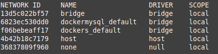
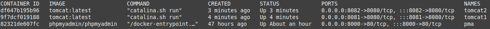
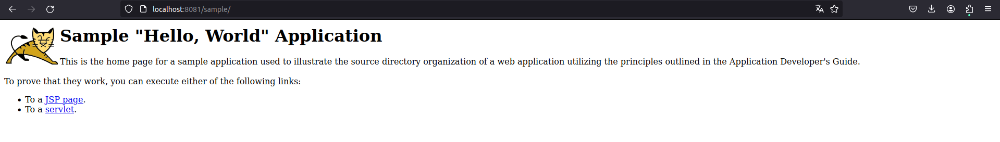
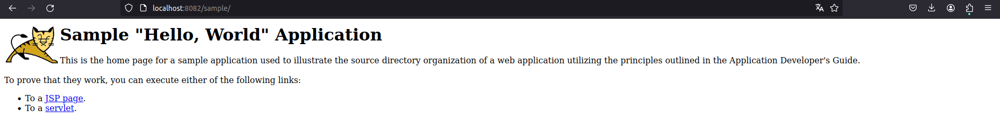

<div align="center">

# **Tarea 5 | Docker**
## **Balanceador NGINX**
  

</div>

<div align="justify">

## Indice
- [Paso 1](#1)
- [Paso 2](#2)
- [Paso 3](#3)
- [Paso 4](#4)
- [Paso 5](#5)

___

### Paso previo - Redes disponibles
Lista el conjunto de redes disponibles en este momento.

```bash
docker network ls
```

**Salida:**   


### Paso 1 - Crear una Red Docker <a name="1"></a>
Docker necesita una red personalizada para que los contenedores puedan comunicarse entre sí. Ejecuta el siguiente comando:

```bash
docker network create tomcat-network
```

### Paso 2 - Levanta los Servidores Tomcat <a name="2"></a>
Levanta dos contenedores Tomcat y conéctalos a la red tomcat-network.

- Servidor Tomcat 1
```bash
docker run -d --name tomcat1 --network tomcat-network -p 8081:8080 tomcat:latest
```
- Servidor Tomcat 2
```bash
docker run -d --name tomcat2 --network tomcat-network -p 8082:8080 tomcat:latest
```

### Paso 3 - Muestra los contenedores dockers activos en ese momento <a name="3"></a>
Muestra el listado de contenedores docker que tienes activos y todos los que tienes disponibles.

```bash
docker ps
```

**Salida:**


### Paso 4 - Fichero de Configuración del Balanceador NGINX <a name="4"></a>
Crea el fichero de balance nginx.conf en el mismo direcctorio donde estes ejecutando la consola de comandos.

```bash
events {}

http {
    upstream tomcat_backend {
        server tomcat1:8080;
        server tomcat2:8080;
    }

    server {
        listen 80;

        location / {
            proxy_pass http://tomcat_backend;
            proxy_set_header Host $host;
            proxy_set_header X-Real-IP $remote_addr;
            proxy_set_header X-Forwarded-For $proxy_add_x_forwarded_for;
        }
    }
}
```

```bash
docker run -d --name nginx --network tomcat-network -p 8080:80 -v ./nginx.conf:/etc/nginx/nginx.conf nginx:latest
```

### Paso 5 - Verificar que todo esta funcionando correctamente <a name="5"></a>
Servidor NGINX
Verifica el comportamiento en:   
```http://localhost:8081```   
```http://localhost:8082```   
```http://localhost```   
```http://localhost:80```

### Desplegar una aplicacion
```bash
docker cp ./sample.war tomcat1:/usr/local/tomcat/webapps/
docker cp ./sample.war tomcat2:/usr/local/tomcat/webapps/
```

   


### Detener y eliminar contenedores
```bash
docker stop tomcat1
docker stop tomcat2

docker rm tomcat1
docker rm tomcat2
```

</div>