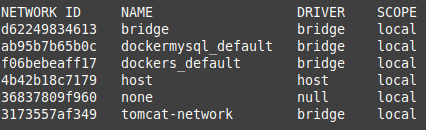
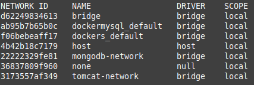
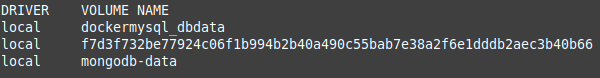
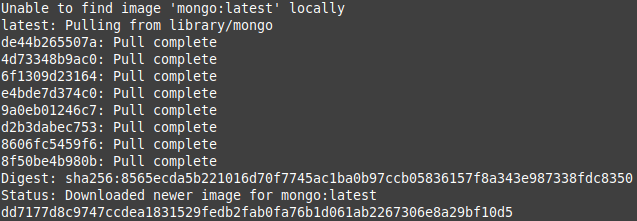
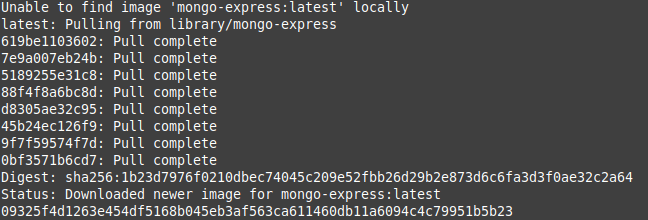
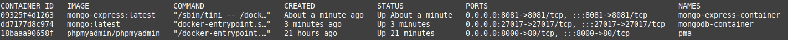
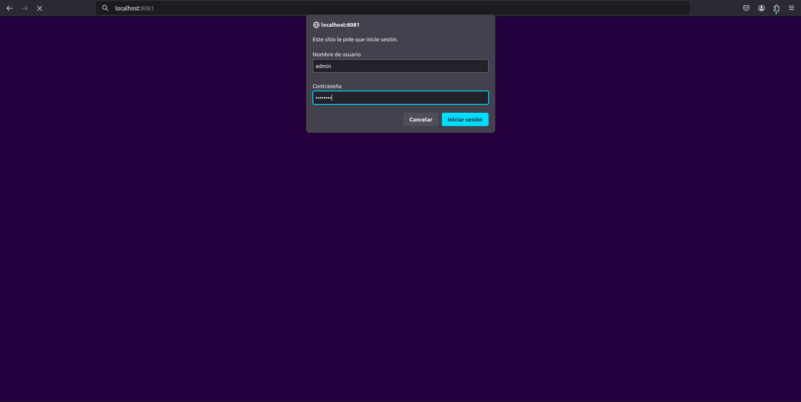
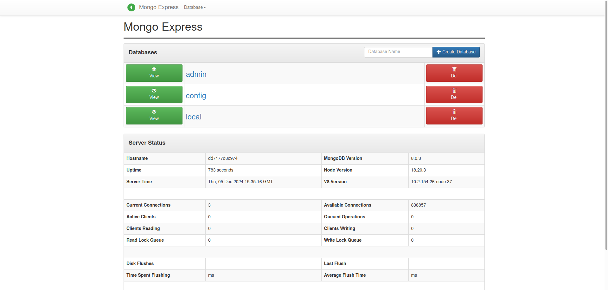
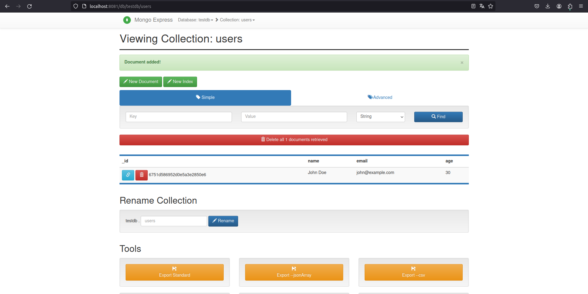
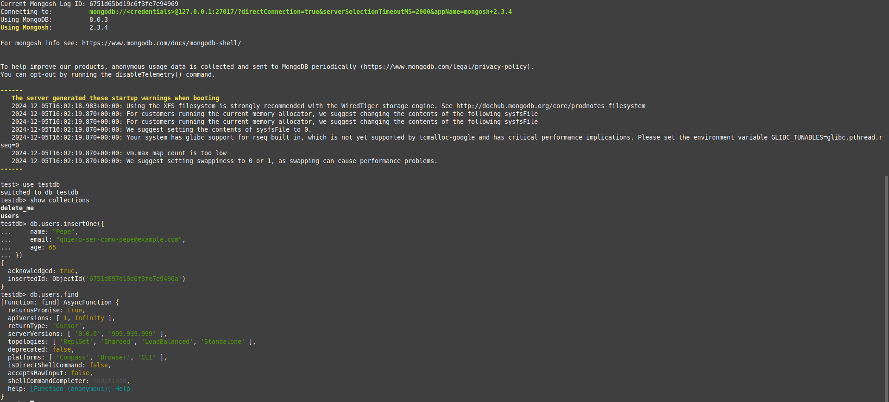

<div align="center">

# **Tarea 6 | Docker**
## **Conectar una Base de Datos NoSQL con un Cliente de Base de Datos.**
  

</div>

<div align="justify">

## Indice
- [Paso 1](#1)
- [Paso 2](#2)
- [Paso 3](#3)
- [Paso 4](#4)
- [Paso 5](#5)
- [Paso 6](#6)
- [Paso 7](#7)

___

### Volúmenes en Docker 
En Docker, un volumen es un mecanismo para almacenar y compartir datos entre contenedores o entre el host y los contenedores. Los volúmenes son administrados por Docker y permiten persistir datos incluso si el contenedor es eliminado. Esto es útil para mantener datos importantes, como bases de datos, configuraciones o cualquier otro archivo que necesite persistencia.

### Redes disponibles
Lista el conjunto de redes disponibles en este momento.

```bash
docker network ls
```

**Salida:**   


### Paso 1 - Crear una red personalizada <a name="1"></a>
Ejecuta el siguiente comando para crear una red llamada ```mongodb-network```:

```bash
docker network create mongodb-network
```

Ejecuta ```docker network ls```, y muestra las redes disponibles en docker.

**Salida:**   


### Paso 2 - Crear un Volumen para MongoDB <a name="2"></a>
Ejecuta el siguiente comando para crear un volumen llamado mongodb-data:

```bash
docker volume create mongodb-data
```

Ejecuta ```docker volume ls```, y muestra el resultado:


**Salida:**   


### Paso 3 - Levantar el Contenedor MongoDB <a name="3"></a>
Usa el siguiente comando para ejecutar MongoDB con el volumen y la red configurados:

```bash
docker run -d --name mongodb-container \
  --network mongodb-network \
  -e MONGO_INITDB_ROOT_USERNAME=admin \
  -e MONGO_INITDB_ROOT_PASSWORD=admin123 \
  -v mongodb-data:/data/db \
  -p 27017:27017 \
  mongo:latest
```

**Salida:**   


### Paso 4 - Levantar el Contenedor Mongo Express <a name="4"></a>
Mongo Express es un cliente web para gestionar MongoDB. Usa este comando para levantar el contenedor:

```bash
docker run -d --name mongo-express-container \
  --network mongodb-network \
  -e ME_CONFIG_MONGODB_ADMINUSERNAME=admin \
  -e ME_CONFIG_MONGODB_ADMINPASSWORD=admin123 \
  -e ME_CONFIG_MONGODB_SERVER=mongodb-container \
  -p 8081:8081 \
  mongo-express:latest
```

**Salida:**   


### Paso 5 - Verificar los Contenedores Activos <a name="5"></a>
Lista los contenedores activos para asegurarte de que están funcionando correctamente:

```bash
docker ps
```

**Salida:**   


### Paso 6 - Verifica los logs de Mongo Express <a name="6"></a>
Verifica los logs de Mongo Express:

```bash
docker logs mongo-express-container
```

Acceder al Cliente Mongo Express Abre tu navegador y visita ```localhost:8081```

**Salida:**   
   



### Paso 7 - Prueba la persistencia de BBDD <a name="7"></a>
Accede a MongoDB desde el Cliente Crea una nueva base de datos llamada testdb.

**Crear la Colección users**

Una vez dentro de la base de datos (por ejemplo, exampledb):

Haz clic en el botón Create.
Collection (Crear colección). Escribe el nombre de la colección, por ejemplo: users. Haz clic en Create (Crear).

**Añadir Documentos a la Colección users**

Abre la colección users.
Haz clic en Add Document (Añadir documento).
Escribe un documento JSON, por ejemplo:

**Verificación**  
- Visualmente 


- Red
```bash
docker network inspect mongodb-network
```

**Salida:**   
```bash
[
    {
        "Name": "mongodb-network",
        "Id": "22222329fe81c8d9882495c01b365fa91efcd0bd6785b757ff17c4b207d514f9",
        "Created": "2024-12-05T15:16:33.078142512Z",
        "Scope": "local",
        "Driver": "bridge",
        "EnableIPv6": false,
        "IPAM": {
            "Driver": "default",
            "Options": {},
            "Config": [
                {
                    "Subnet": "172.19.0.0/16",
                    "Gateway": "172.19.0.1"
                }
            ]
        },
        "Internal": false,
        "Attachable": false,
        "Ingress": false,
        "ConfigFrom": {
            "Network": ""
        },
        "ConfigOnly": false,
        "Containers": {
            "09325f4d1263e454df5168b045eb3af563ca611460db11a6094c4c79951b5b23": {
                "Name": "mongo-express-container",
                "EndpointID": "8ba93eacd1b30a5276aa972c962a7f82b727bc88d0d91ee5638868ebf75f19ca",
                "MacAddress": "02:42:ac:13:00:03",
                "IPv4Address": "172.19.0.3/16",
                "IPv6Address": ""
            },
            "dd7177d8c9747ccdea1831529fedb2fab0fa76b1d061ab2267306e8a29bf10d5": {
                "Name": "mongodb-container",
                "EndpointID": "6982c793f4e83cb9443de298c6a2028ce62ad57a29a852f13a7e3cd55a19f54d",
                "MacAddress": "02:42:ac:13:00:02",
                "IPv4Address": "172.19.0.2/16",
                "IPv6Address": ""
            }
        },
        "Options": {},
        "Labels": {}
    }
]
```

**Conectividad con la BBDD**
Realiza la verificación con la BBDD. Lanza el siguiente comando:
```bash
docker exec -it mongodb-container mongosh -u admin -p admin123
```
Utiliza la bbdd testdb:
```bash
use testdb
```
Lista las colecciones que tienes disponibles:
```bash
show collections
```
Añade un nuevo documento a la colección:
```bash
db.users.insertOne({
    name: "Pepe",
    email: "quiero-ser-como-pepe@example.com",
    age: 65
})
```
Muestra los valores almacenados:
```bash
db.users.find()
```

**Salida:**   


> :memo: La forma de salir es ejecutando exit.

### Detener y eliminar contenedores
```bash
docker stop mongodb-container
docker stop mongo-express-container

docker rm mongodb-container
docker rm mongo-express-container
```

</div>